<h2 align="center">🔹 Projeto Savini - Oficina automotiva</h2>

Bem-vindo(a) ao Projeto Savini, um sistema desenvolvido para facilitar a gestão de serviços automotivos, cadastros de clientes, controle de ordens de serviço e acompanhamento de manutenção de veículos.
O objetivo deste projeto é automatizar os processos administrativos de uma oficina mecânica, oferecendo mais agilidade, organização e controle para o negócio.
 
<h3 align="center">🔹 Tecnologias Utilizadas</h3>

Frontend: HTML, CSS, JavaScript  
Backend: Java  
Banco de Dados: PostgreSQL  
Outras: Angular  

<h3 align="center">🔹 Estrutura Projeto Savini</h3>

```
 ├── Clientes  
    ├── Cadastro de clientes  
    ├── Histórico de atendimentos  
    └── Contatos e notificações

 ├── Veículos  
    ├── Cadastro de veículos  
    ├── Histórico de manutenções  
    ├── Vínculo com cliente  
    └── Alertas de revisão

 ├── Ordens de Serviços  
    ├── Cria nova OS  
    ├── Serviços executados  
    ├── Peças utilizadas  
    ├── Orçamento e aprovação  
    └── Status da OS  
        ├── Aberta  
        ├── Em execução  
        └── Finalizada

 ├── Serviços  
    ├── Cadastro de tipos de serviços  
    ├── Tempo estimado  
    ├── Custo por serviço  
    └── Agrupamento por pacote de revisão

 ├── Peças e Estoque  
    ├── Castro de peças  
    ├── Controle de estoque  
    ├── Entradas e saídas  
    └── Alerta de reposição

 ├── Financeiro  
    ├── Contas a receber  
    ├── Contas a pagar  
    ├── Fluxo de caixa  
    └── Relatórios financeiros

 ├── Agenda  
    ├── Agendamento de serviços  
    ├── Visualização de disponibilidade  
    └── Lembretes automáticos

 ├── Configurações  
    ├── Usuários e permissões  
    ├── Configurações gerais da oficina  
    ├── Backup e segurança  
    └── Sair
```

<h3 align="center">🔹 Wireframes Projeto Savini</h3>

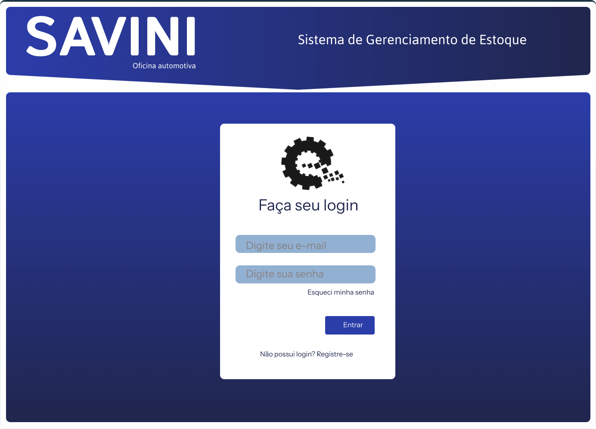

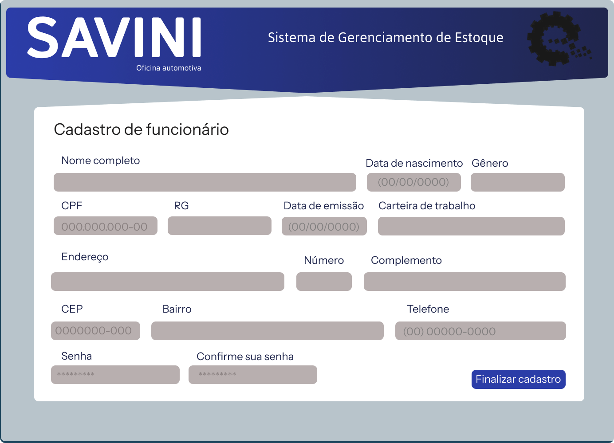

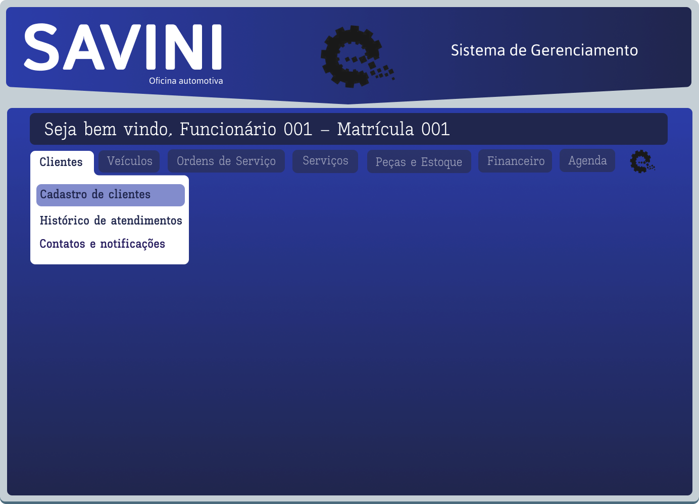

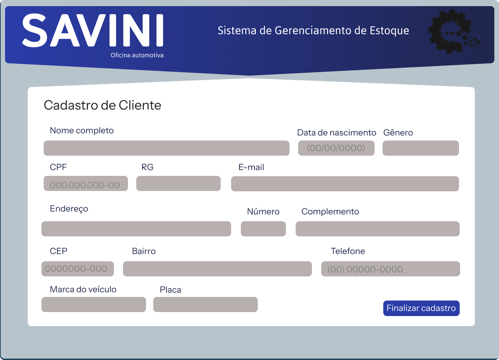

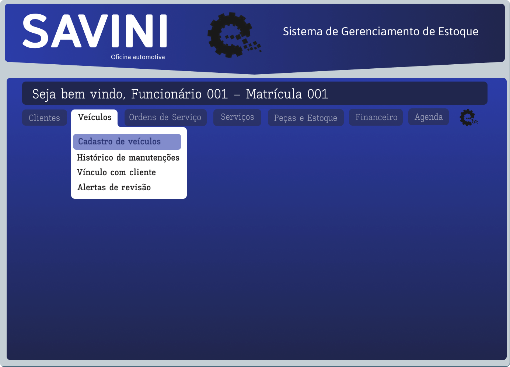

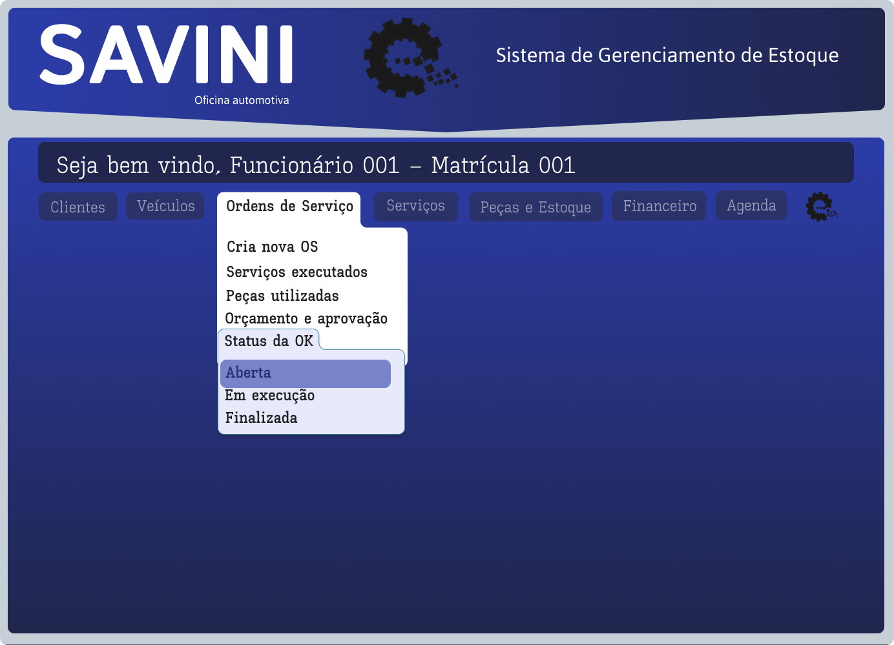

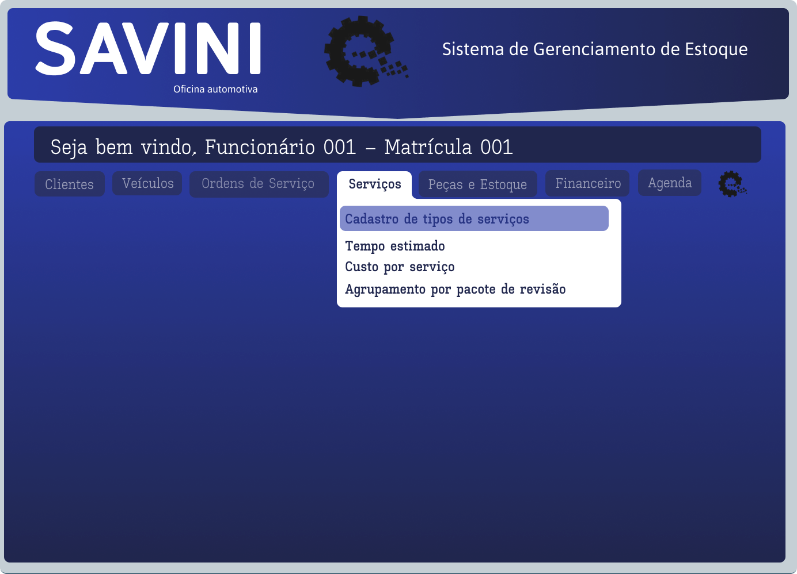

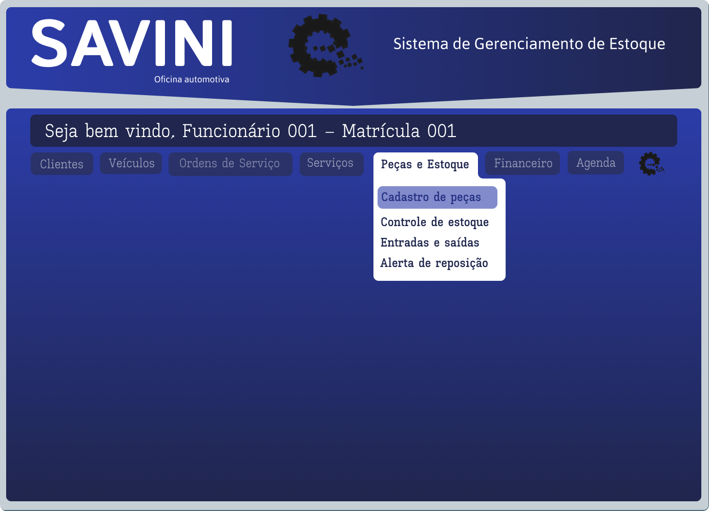

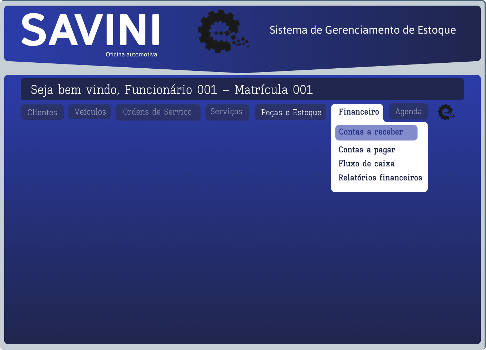

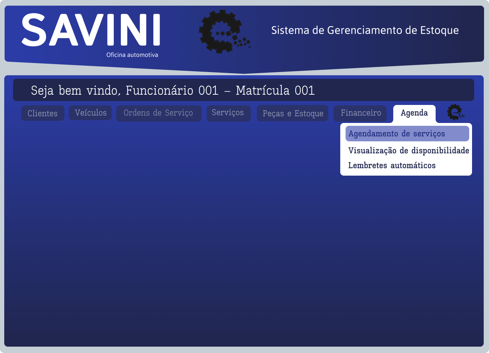

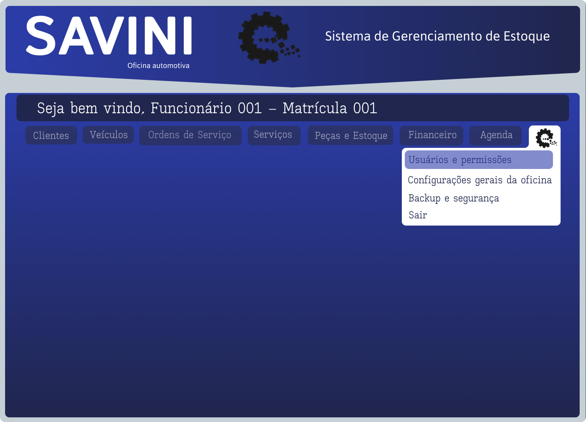

<h3 align="center">🔹 Autora: Luana Silva</h3>
<div align="center">

[](https://www.linkedin.com/in/luana-fesilva/)
[](mailto:luanasilvaueg@gmail.com)

  
</div>
